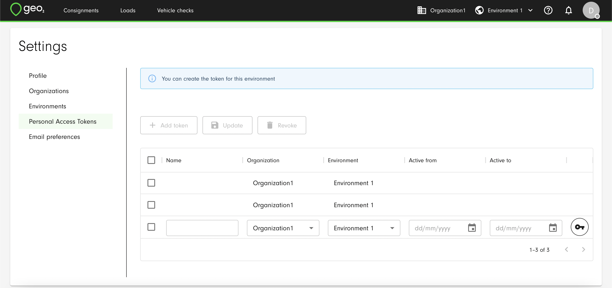
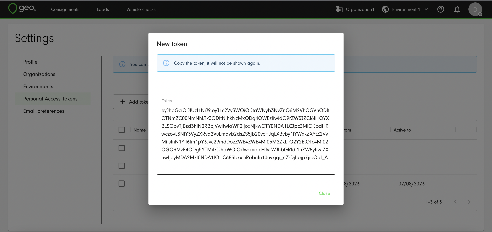

[API](../API.md)

# Authentication

As a user, you can request authentication tokens in the Hub user interface.  Tokens are used as bearer tokens in requests to the Geo2 API and are local to each environment in your Geo2 organization.

# Personal Access Tokens

Personal access tokens are used to authenticate you to the Geo2 API.  You do not need them if your user account is not being used for data integration with Geo2.

To create your personal access tokens you need to visit the Profile menu in Hub and click on the Add Token button.

You select the environment to which the token belongs and the dates within which it is to be active.  Once a token has been created, copy its value as it will not be shown again. 

The token gives programmatic access to Geo2 using your user credentials.  For maximum security, revoke any tokens that are not needed - you can select a token and press `REVOKE`.  You can further make sure a token isn't used when it is not needed by setting the `Active from` and `Active to` dates.
