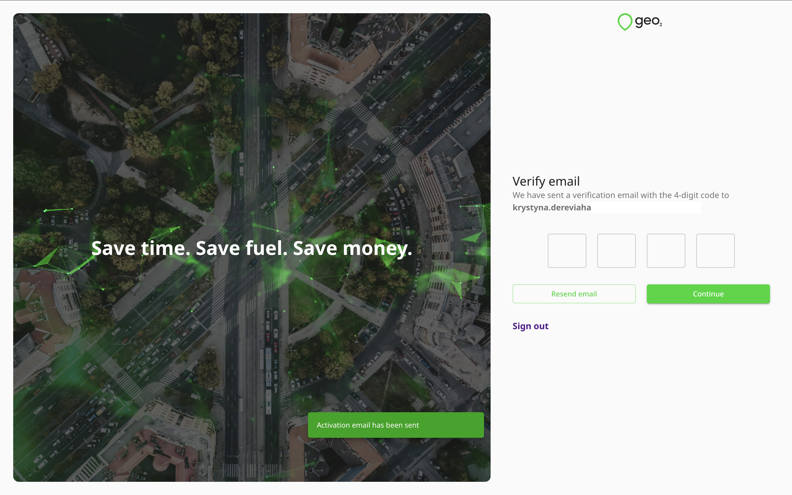
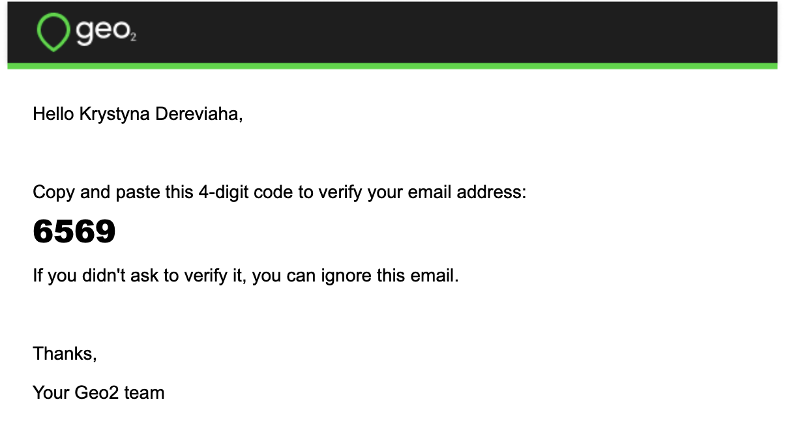
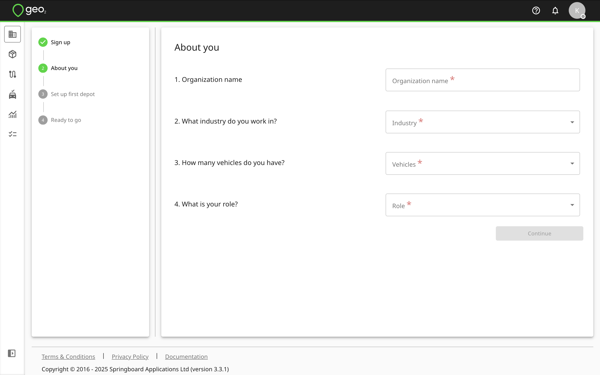
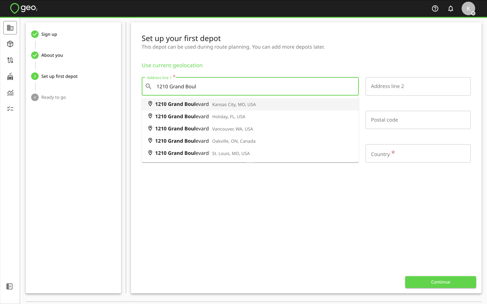
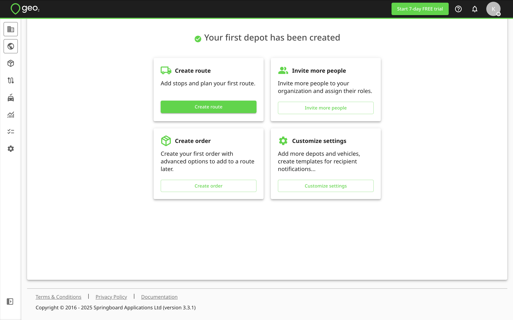
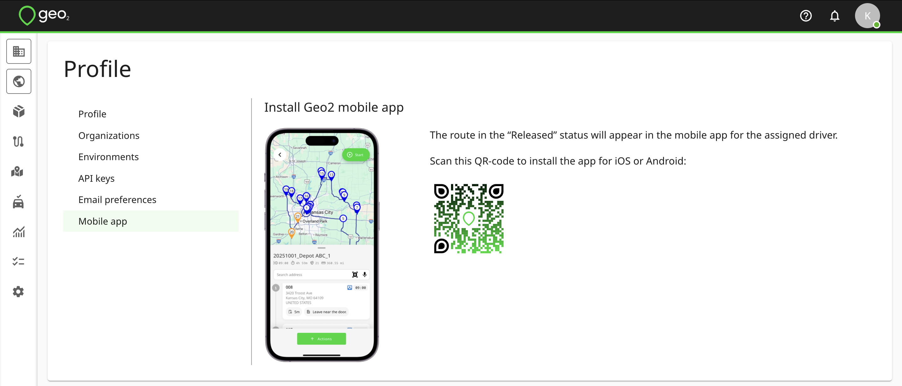

# Getting Started

- [Introduction](#introduction)
- [Register Account](#register-account)
  - [Activate Email](#activate-email)
- [Set Up Organization](#set-up-organization)
- [Install Geo2 Mobile App](#install-geo2-mobile-app)

  - [Important Data Notice](#important-data-notice)- [Recommended Hardware](#recommended-hardware)

# Introduction

To create a Geo2 user account, register either with a browser at [**Geo2 Hub**](https://hub.geo2.com/en-GB/auth/register) or through the mobile app.

If you are joining an existing organization, the admin of that organization needs to add your user account and assign a subscription to you.  Learn how to [Hub: Accept Invitation](Web-Based%20Hub/Hub_%20Accept%20Invitation.md)

# Register Account

On Registration page, after you have completed the requested details, press `Register` to create an account, using the password you have specified.  Alternatively, you can press the buttons for other authentication providers in order to authenticate with your existing Google, Microsoft, or Apple identity instead.  Also, you can register using your mobile phone number. Learn more about registration in [Hub: Register](Web-Based%20Hub/Hub_%20Register.md) and [Mobile App: Register](Mobile%20App/Mobile%20App_%20Register.md). 

## Activate Email

If you register an account using an email and password, you need to activate it.  You will get a verification email with a one-time code that you need to copy and paste into the form in Hub.  Learn more about [Hub: Register](Web-Based%20Hub/Hub_%20Register.md).

# Set Up Organization

Once your account is created and the email is verified, you need to set up your Geo2 organization.  We ask for information about your company to set up an organization for you.

By pressing the `Continue` button, you will be redirected to Set up first depot page. This depot can be optionally used during route planning. You can add more depots later in [Hub: Environment Settings](Web-Based%20Hub/Hub_%20Environment%20Settings.md).

You can start searching for the address by typing it in the Address line 1 field or giving access to your current geolocation.  Once the address is provided, you can drag and drop the pin on the map to adjust the address. By pressing the `Continue` button, your organization, environment, and its first depot will be created.

**Organization** is a group of users who share a subscription and collaborate on data in one or more environments. By default, for your newly created organization, **you get a** **Free subscription, no card required.**

**Environments** let you represent teams within a single company or provide separate spaces for testing and productive use.

Examples:

- A large company (organization) with smaller teams (environments) working on different projects.
- A holding company (organization) with smaller companies (environments) working in different spheres.
- A middle-size company (organization) with several depots (environments).

Next, you can select one of the following options to start working with Geo2 Hub:

- **Create route** (recommended). Add stops and plan your first route. Learn more about [Hub: Routes](Web-Based%20Hub/Hub_%20Routes.md).
- **Create order**. Create your first order with advanced options to add to a route later. Learn more about [Hub: Orders](Web-Based%20Hub/Hub_%20Orders.md).
- **Invite more people**. Invite more people to your organization and assign their roles. Learn more about [Hub: Organization Settings](Web-Based%20Hub/Hub_%20Organization%20Settings.md).
- **Customize settings**. Add more depots and vehicles, create templates for recipient notifications. Explore your [Hub: Environment Settings](Web-Based%20Hub/Hub_%20Environment%20Settings.md).

When orders are created and added to a route, the route can be released to a driver.  It will be displayed in the mobile app for the assigned driver.

# Install Geo2 Mobile App

By pressing your avatar and selecting the `Profile` option, you will be redirected to Profile menu. Press on `Mobile app` tab. There is a QR code to install the app for iOS or Android.  Depending on the OS of your device, you will either be redirected to App Store (if iOS) or Google Play (if Android).

> [!CAUTION]
> ### Important Data Notice
>
> Before proceeding with a mobile app update, make sure your data are synchronised to guard against potential data loss.

The mobile app is available from[**App Store**](https://apps.apple.com/app/geo2/id1594180686) and [**Google Play**](https://play.google.com/store/apps/details?id=com.geo2.app).

## Recommended Hardware

> [!CAUTION]
> Due to the large number of available mobile devices, it is not possible to test compatibility with all of them.  We recommend that a sample device is sourced and tested for compatibility with the application before any larger purchase.

The minimum supported operating system versions are:

- Android 11
- iOS 16.1

On any device, it is important to ensure spare hardware capacity is available, both in terms of storage and not overloading the device with a large number of running apps.  Here are examples of device models, which have been successfully used with Geo2:

- Google Pixel 7 Pro, Android 14
- Oppo Find X5 Pro
- Samsung Galaxy A05
- Samsung S20, Android 12 and up
- Xiaomi Poco X3 Pro, Android 12
- iPhone 12, 12 Pro, 12 Pro Max
- iPhone 13, 13 Pro, 13 Pro Max
- iPhone 14, 14 Pro, 14 Pro Max

Aim to meet or exceed the hardware specifications of these devices.
