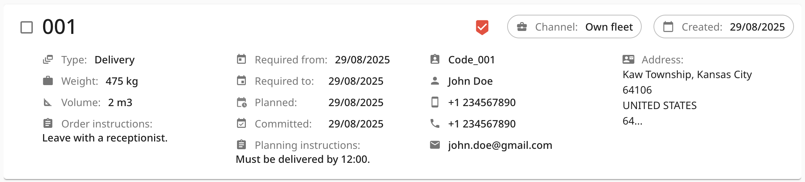
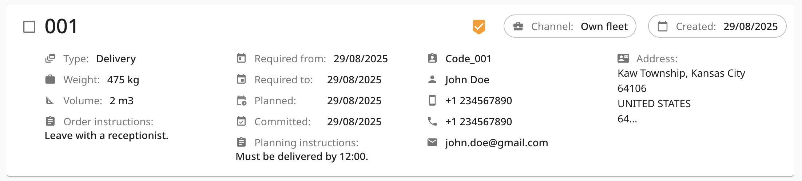
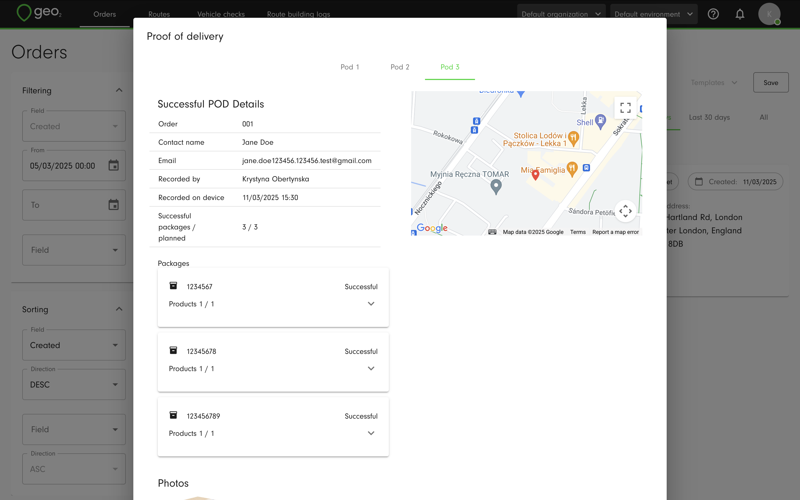

[Web-Based Hub](../Web-Based%20Hub.md)

# Hub: Orders

- [Orders List](#orders-list)
  - [Filters](#filters)
  - [POD Status](#pod-status)
- [Order Creation](#order-creation)
- [Order Editing](#order-editing)
- [Proof of Delivery](#proof-of-delivery)
- [Notification History](#notification-history)
- [Geo-Coding Indicators](#geo-coding-indicators)

Orders are records of deliveries/collections to be handled by a driver, typically as part of a route, a group of orders.

# Orders List

To list orders in the environment, select `Orders` from the toolbar. By default, orders created in the last 7 days are listed.  You can select the other two tabs to show orders created in the last 30 days or list all orders in the environment.  Full filtering and sorting criteria are only available for the 7-day and 30-day tabs.

## Filters

To narrow down the list of orders, you can use the Filters left to the Orders list.  The following filters are available: 

|  **Filter**            |  **Operation**    |  **Details**                                                                                                                                                                                                                                                     |
|:-----------------------|:------------------|:-----------------------------------------------------------------------------------------------------------------------------------------------------------------------------------------------------------------------------------------------------------------|
| Created                | From/To           | Order creation date                                                                                                                                                                                                                                              |
| Key                    | Contains          | Order key                                                                                                                                                                                                                                                        |
| Route                  | Contains          | Key of route to which the order is assigned                                                                                                                                                                                                                      |
| Route assignment       | Select            | Choose order:  <ul><li>
Assigned to a route 
</li><li>
Without a route
</li></ul>                                                                        |
| Depot                  | Select            | Key of depot to which the order is assigned                                                                                                                                                                                                                      |
| Type                   | Select            | Order type:  <ul><li>
Delivery
</li><li>
Collection
</li></ul>                                                                                                                                                                                     |
| Channel                | Select            | Order channel                                                                                                                                                                                                                                                    |
| Area                   | Select            | Order area                                                                                                                                                                                                                                                       |
| Weight                 | From/To           | Order weight                                                                                                                                                                                                                                                     |
| Volume                 | From/To           | Order volume                                                                                                                                                                                                                                                     |
| Required from          | From/To           | Order required from date/time                                                                                                                                                                                                                                    |
| Required to            | From/To           | Order required to date/time                                                                                                                                                                                                                                      |
| Committed              | From/To           | Order committed date/time                                                                                                                                                                                                                                        |
| Planned                | From/To           | Order planned date/time                                                                                                                                                                                                                                          |
| POD status             | Select            | Status of POD linked to the order:  <ul><li>
Success
</li><li>
Failed
</li><li>
Without POD
</li></ul> |
| Order instructions     | Contains          | Order driver instructions                                                                                                                                                                                                                                        |
| Planning instructions  | Contains          | Order planner instructions                                                                                                                                                                                                                                       |
| Recipient code         | Contains          |                                                                                                                                                                                                                                                                  |
| Recipient contact name | Contains          |                                                                                                                                                                                                                                                                  |
| Email                  | Contains          | Recipient email                                                                                                                                                                                                                                                  |
| Phone                  | Start with        | Recipient phone                                                                                                                                                                                                                                                  |
| Mobile phone           | Start with        | Recipient mobile phone                                                                                                                                                                                                                                           |
| Company name           | Contains          | Recipient company name                                                                                                                                                                                                                                           |
| Address line 1, 2, 3   | Contains          | Recipient address - lines 1, 2, 3                                                                                                                                                                                                                                |
| City                   | Contains          | Recipient address - city                                                                                                                                                                                                                                         |
| Postal code            | Contains          | Recipient address - postal code                                                                                                                                                                                                                                  |
| Region                 | Contains          | Recipient address - region                                                                                                                                                                                                                                       |
| State                  | Contains          | Recipient address - state                                                                                                                                                                                                                                        |
| Country                | Is                | Recipient address - country                                                                                                                                                                                                                                      |

## POD Status

Where a POD has been recorded for the order, it is indicated with a status icon in the top row of each order card.  A failed POD is red:

A successful POD is shown green:

A partially successful POD is orange:

You can press the POD icon to open the recorded POD.  If an order has several recorded POD's, they will be displayed in separate tabs as Pod 1, Pod 2, etc.

# Order Creation

On the `Order` page, press `Create` button to create an order.  You will be redirected to Create order page.

Here are the order properties you can specify:

|  **Property**         |  **Description**                                                                                                                                                                                                                                                                                                                                                                                                                                                                                                                     |
|:----------------------|:-------------------------------------------------------------------------------------------------------------------------------------------------------------------------------------------------------------------------------------------------------------------------------------------------------------------------------------------------------------------------------------------------------------------------------------------------------------------------------------------------------------------------------------|
| Key                   | Order identifier unique within the environment, for example, an order number 1, 2, 3, 4, etc.                                                                                                                                                                                                                                                                                                                                                                                                                                        |
| Type                  | Type of order - `delivery` or `collection.`                                                                                                                                                                                                                                                                                                                                                                                                                                                                                          |
| Weight and Volume     | Number to specify the total order weight/volume in the weight/volume units specified in `Environment settings -> Display preferences`.  One of the uses is the calculation of the peak load weight and volume for a route.                                                                                                                                                                                                                                                                                                           |
| Package count         | Number of packages expected as part of the order.  For example, 2.  The field becomes non-editable if packages are specified in the Packages tab.                                                                                                                                                                                                                                                                                                                                                                                    |
| Channel               | Tag that lets you classify delivery methods.  Select a channel key from options defined in `Environment settings -> Channels`.                                                                                                                                                                                                                                                                                                                                                                                                       |
| Area                  | Tag that lets you identify depots, order and routes by user-defined geographical regions.  Select an area key from options defined in `Environment settings -> Areas`.                                                                                                                                                                                                                                                                                                                                                               |
| Route                 | Optional assignment of the order to a route.  Once selected, by hovering over the route key and pressing it, you can open this route in a new tab of the browser to view its details.   **If a route starts or ends at a depot, orders with depots must match**: the delivery depot must align with the start, and the collection depot with the end. Orders without assigned depots can be added to any route, and if a route does not use a depot as its start or end point, any order, with or without a depot, can be added. |
| Depot                 | Depot in which the order is being handled.  Select a depot key from options defined in `Environment settings -> Depots`.                                                                                                                                                                                                                                                                                                                                                                                                             |
| Required from         | For information - from when the customer requires the order to be delivered/collected.                                                                                                                                                                                                                                                                                                                                                                                                                                               |
| Required to           | For information - till when the customer requires the order to be delivered/collected.                                                                                                                                                                                                                                                                                                                                                                                                                                               |
| Committed             | For information - date/time that has been agreed with the order for delivery/collection.                                                                                                                                                                                                                                                                                                                                                                                                                                             |
| Planned               | For information - date/time when the order is planned to be delivered/collected.                                                                                                                                                                                                                                                                                                                                                                                                                                                     |
| Stop duration         | The amount of time the delivery vehicle is expected to remain at a route stop. This is used when orders are first brought into a route and, together with drive times, stop durations are intended to lead to route durations that are more realistic than if only drive time was considered.                                                                                                                                                                                                                                        |
| Order instructions    | Optional notes for drivers that are shown in the mobile app.  For example, "leave with reception".                                                                                                                                                                                                                                                                                                                                                                                                                                   |
| Planning instructions | Optional notes for transport planners that are shown in the stop card in the Route plan page and not shown in the mobile app.  For example, "must be delivered by 11:00".                                                                                                                                                                                                                                                                                                                                                            |
| Tab - Recipient       | Recipient - contact details and address.                                                                                                                                                                                                                                                                                                                                                                                                                                                                                             |
| Tab - Products        | Optional details of products in the order - product code, commodity code, barcode, description, quantity, currency, unit price, unit tax, tax rate, country of origin.                                                                                                                                                                                                                                                                                                                                                               |
| Tab - Packages        | Optional package details - barcode, height, width, depth, volume, weight.  Packages can optionally specify the products and quantities they contain.                                                                                                                                                                                                                                                                                                                                                                                 |
| Tab - Sender          | Sender contact details and address, taken from the environment settings by default.                                                                                                                                                                                                                                                                                                                                                                                                                                                  |

On the Main info tab, the required fields are Key and Type.

Press the `Next` button to be redirected to the next tab inside an order creation.  On the Recipient tab, the required fields are Address line 1, City, and Country.  To enter the address, you can start typing it into Address line 1 and selecting it from the drop-down which appears.  If no suitable match is found, continue entering the address in the relevant address fields manually. Once the address is selected and the pin is visualised on the map, you can drag-and-drop it to adjust the location if needed.

You can also allow Public tracking and POD notifications on the order level.  Even if they are allowed in Environment settings, you can disable them for an individual order and notifications will not be sent to the recipient.  If you set up fixed recipients for failed and partially successful POD notifications, emails will be sent even if they are turned off on an order level.

Press the `Next` button to be redirected to the Products tab.  Product is optional for an order creation.  Required fields for a product creation are Product code and Quantity.

Products can be added to packages.  Press the `Next` button to be redirected to the Packages tab.  Packages are also optional for an order creation.  There are no required fields.

Press the `Next` button to be redirected to the Sender tab.  Here are sender contact details and address, taken from environment settings by default.  This address will be displayed on the POD PDF sent to a recipient if POD notification emails with PDF attaching are enabled in Environment settings.

"Proof of delivery" and "Notification history" tabs are disabled during an order creation, you can find created POD and notifications sent to a recipient relevant to this order later.

When you press `Create`, contents of the order form will be validated and an order created.  When successful, you will see an information message `Order has been created`:

The created order will be displayed in the Orders list.

# Order Editing

When you click on an order key on an order card in the Orders list, you can edit its properties. Consider the impact of edits if the order has already been included in a route.

When editing, the `Save` button has two different options you can toggle via the down-pointing arrow:

- `Save and continue editing` - saves your changes without returning to the `Orders` list.  This way you can save updates you have made so far before, for example, moving to another tab.
- `Save and exit` - saves the order changes and takes you to the `Orders` list.

# Proof of Delivery

When a POD has been recorded in the mobile app, you can find it by clicking on the green/yellow/red POD icon on the order card on Orders page.  Also, it will be displayed in Proof of Delivery tab inside the order.

If an order has packages and products, they will be displayed on the POD page with their status - Successful, Partially successful or Failed.  For the partially successful or failed status, the failure reason code is shown.  At a product level, the quantities delivered out of the total planned are shown too.

Example of partially successful POD:

Example of failed POD:

Example of successful POD:

If an orders has several recorded POD's, they will be displayed in separate tabs as Pod 1, Pod 2, etc.

You can click on the `Download PDF` button to save POD as a PDF file.  If manual sending of POD is enabled in the [Hub: Environment Settings](Hub_%20Environment%20Settings.md), you will see the `Email to recipient` button.  By pressing it, the POD email will be sent to the recipient's email address.

# Notification History

If you have set up sending the [Hub: Environment Settings](Hub_%20Environment%20Settings.md) and [Hub: Environment Settings](Hub_%20Environment%20Settings.md) and an order has indicated the **recipient** **email address/mobile phone number**, you can then track the statuses of emails/SMS notifications on Notification history tab inside the Order details.

|  **Column**    |  **Description**                                                                                                                                                                                                                             |
|:---------------|:---------------------------------------------------------------------------------------------------------------------------------------------------------------------------------------------------------------------------------------------|
| Type           | The type of notification that has been sent: Successful POD email, Partially successful POD email, Failed POD email, Public tracking email, Public tracking SMS.                                                                             |
| Date/time      | The date and time when the email/SMS notification has been sent to the recipient.                                                                                                                                                            |
| Recipient      | Recipient email address (POD and Public tracking emails) and mobile phone number (for Public tracking SMS).  Every fixed recipient for a Failed POD email will be displayed separately in the table to check the status of every sent email. |
| Status         | The status of the email/SMS that has been sent.  Statuses for emails are Sent, Undelivered, Delivered, Opened, and Clicked.  Statuses for SMS notifications are Sent, Undelivered, and Delivered.                                            |

# Geo-Coding Indicators

Geo-coding precision for addresses/locations is shown throughout Geo2 as:

|  **Icon**                                                       |  **Status**    |
|:----------------------------------------------------------------|:---------------|
|  | Accurate       |
|  | Accurate area  |
|  | Approximate    |
|  | Missing        |

If you want to modify the previously determined address geo-location, you can edit it in Order > Recipient by pressing the `Manual geocoding` button.

The Geo Code dialog will be displayed.  Checkboxes near the address fields allow you to control which data will be used for geocoding.  By default, enabled fields are taken from [Hub: Environment Settings](Hub_%20Environment%20Settings.md).  To check a new geolocation, press the `Check Geo Point` button.  It is often the case that using all parts of the address will lead to a better location match.

You can also edit latitude and longitude or move the pin on the map to adjust the address.

Once you are happy with the result, press the `Save` button.  The geolocation icon will be shown in green.
