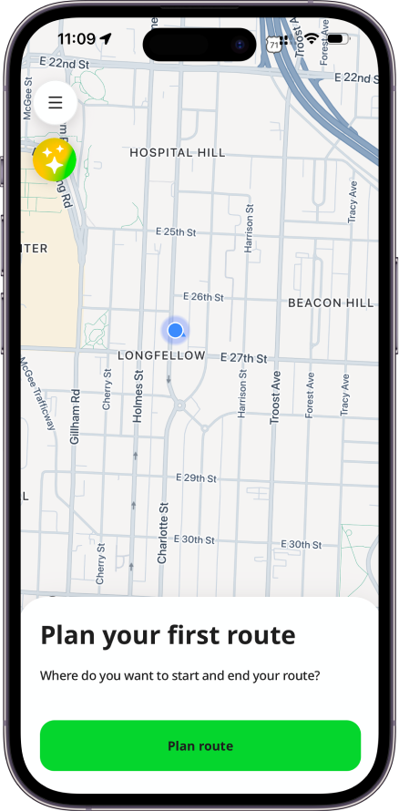
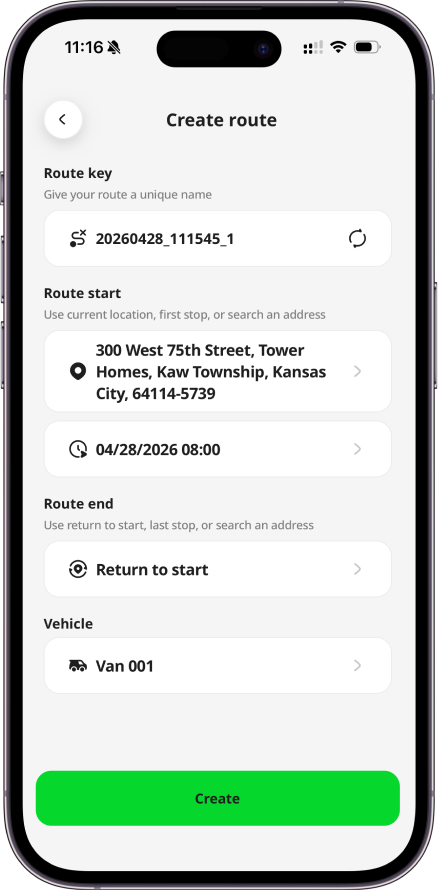
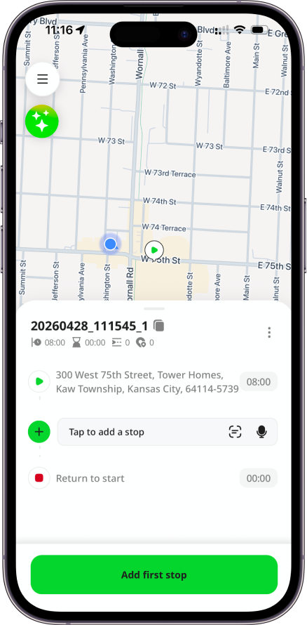
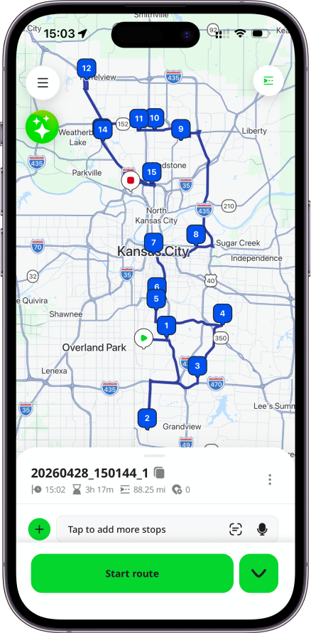
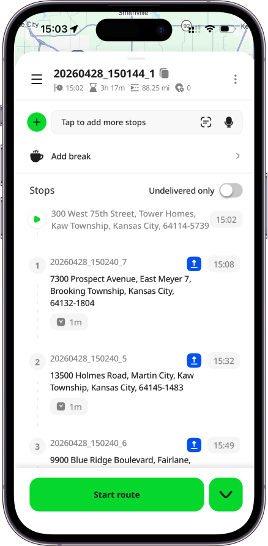
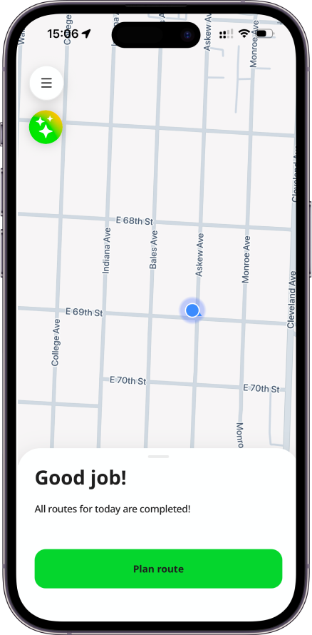

# Mobile App: Map

# Introduction

After signing in successfully, you will see the Map page. You may receive invitations to join other organizations. To [Hub: Accept Invitation](../Web-Based%20Hub/Hub_%20Accept%20Invitation.md), [Mobile App: Sign In](Mobile%20App_%20Sign%20In.md) to the app using the email address that received the invitation. If you have no invitations, the default organization will be created. The **Free level subscription** will be assigned, with **no card required**. You can start working with the app immediately:

- Plan routes
- Add stops using address typing, multi-address scanning, voice search, or bulk address pasting
- Load vehicle with photos
- Start and complete routes
- Navigate to stops using your preferred navigation app (Waze, Google Maps, Apple Maps, etc.)
- Create PODs and vehicle checks with signatures and photos

With the AI assistant, you can also:

- Create and update routes
- Add stops to your current route using text or voice input
- Optimize routes with or without required stop time windows
- Start and complete routes
- Navigate seamlessly within the app
- Get step-by-step guidance on using different features

# Plan Route

On Map page, by clicking the `Plan route` button, you can choose to create a route if you have permission to do it.  Check more details about [Mobile App: Routes and Stops](Mobile%20App_%20Routes%20and%20Stops.md).

# Assigned Routes

Routes assigned to you display automatically based on priority when you launch the app or complete a route. First, if you previously selected a route that is incomplete, the app reopens it. If not, and you have routes released for today, the app opens the earliest route unless you explicitly selected another route earlier today. You can start it, create vehicle check, navigate to stops, create PODs, and complete a route.

If neither applies, you will see an empty map with a relevant call to action.

After completing a route, if other routes remain today, a “Good job” bottom sheet appears with a `Go to next route` button that opens the next earliest incomplete route. If all today's routes are complete, the next step depends on your permissions: if you can create routes, you see a `Plan route` button; otherwise, you are directed to the `Routes` screen. When no routes exist for today, the empty state adjusts accordingly: if you can create routes, you are prompted to plan one. If you cannot create routes, you are redirected to the Routes screen, where you can view upcoming routes, each displayed with a small map preview.

# Menu

Press the `menu` icon at the top-left corner to open the menu. If you have permissions, the menu includes the following options:

- Ask AI assistant
- Plan a route
- Create a POD
- Create a vehicle check
- Check routes list
- Check PODs history
- Check vehicle checks history
- Review pending uploads for your PODs and vehicle checks
- Configure settings
- Change organization and environment if you have multiple
- Access your profile information

Check more details about [Mobile App: Menu](Mobile%20App_%20Menu.md).

