# Mobile App: Menu

# Introduction

Press the `menu` icon at the top-left corner of Map page to open the menu. If you have permissions, the menu includes the following options:

- Ask AI assistant
- Plan a route
- Create a POD (Proof of delivery)
- Create a vehicle check
- Check routes list
- Check PODs history
- Check vehicle checks history
- Review pending uploads for your PODs and vehicle checks
- Configure settings
- Change organization and environment if you have multiple
- Access profile information

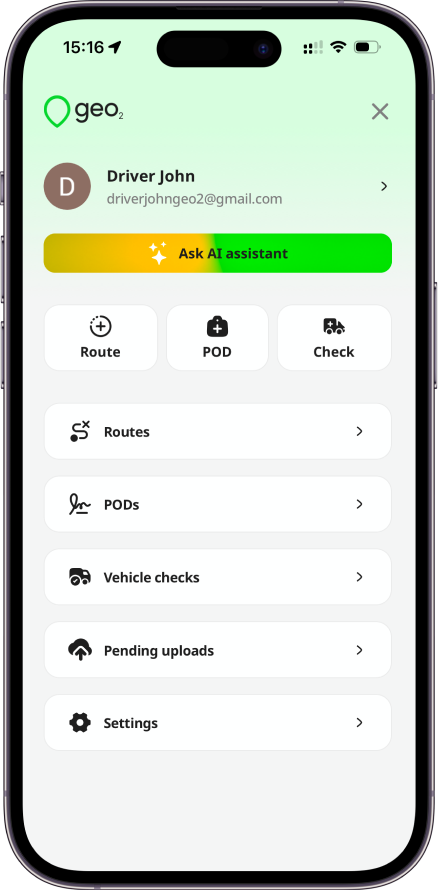

# Ask AI Assistant

The AI assistant helps you manage your daily route work faster and with less manual tapping. It is especially useful when you are working solo and need to adjust plans on the go, add new stops, understand what to do next, or quickly find your way around the mobile app.

You can interact with the assistant using text or voice input, making it easier to use while preparing for a route, during breaks, or when plans change during the day.

With the AI assistant, you can:

- Create new routes and update existing ones
- Add stops by providing a list of addresses
- Optimize routes, with or without required stop time windows
- Start and complete routes
- Navigate through the app
- Get step-by-step guidance on how features work

**Use cases:**

1. You can ask the assistant to create a route from several addresses you received by message or email, instead of entering each stop manually.

2. If new urgent stop comes up during the day, you can ask the assistant to add it to your current route and re-optimize the order.

3. When some stops must be visited within specific time windows, the assistant can help you build a route that respects those requirements.

4. If you’re unsure how to use a feature, you can ask the assistant for step-by-step instructions directly in the app.

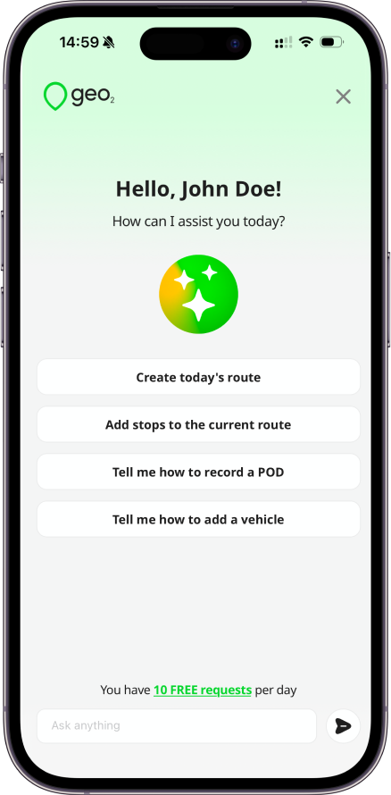

# Plan Route

By clicking the `Plan route` button, you can choose to create a route if you have permission to do it.  Check more details about [Mobile App: Routes and Stops](Mobile%20App_%20Routes%20and%20Stops.md).

# Create POD

By clicking the `Create POD` button, you can choose to create a Proof of delivery with photos and signatures either for existing order or not yet planned.  Check more details about [Mobile App: POD - Proof of Delivery](Mobile%20App_%20POD%20-%20Proof%20of%20Delivery.md).

# Create Vehicle Сheck

By pressing the `Create vehicle check` button, you can create an unplanned / ad-hoc vehicle check that is not related to any route. Check more details about [Mobile App: Vehicle Checks](Mobile%20App_%20Vehicle%20Checks.md). Creating vehicle checks is available with Advanced or Enterprise subscription level.

# Routes

Press the `Routes` option to open Routes Calendar page. It lets you view routes that have been released to you, each displayed with a small map preview.  By default, routes planned for the current date are shown, but you can select other dates to show routes for those dates.  The green dot below the date means that you have planned routes assigned to you for this date.  Learn more about [Mobile App: Routes and Stops](Mobile%20App_%20Routes%20and%20Stops.md).

In the mobile app, you can view routes from the past 30 days and the next 30 days. To access the full routes history, you can visit [**Geo2 web-based Hub**](https://hub.geo2.com/en-GB/auth/signin). Data older than 30 days is available with Pro, Advanced, or Enterprise subscription.

# PODs

To review the history of PODs recorded by you, click on `PODs` option.  By clicking on the POD card, you can view its details.  Learn more about [Mobile App:  POD History](Mobile%20App_%20%20POD%20History.md).

In the mobile app, you can view PODs history from the past 30 days. To access the full PODs history, you can visit [**Geo2 web-based Hub**](https://hub.geo2.com/en-GB/auth/signin). Data older than 30 days is available with Pro, Advanced, or Enterprise subscription.

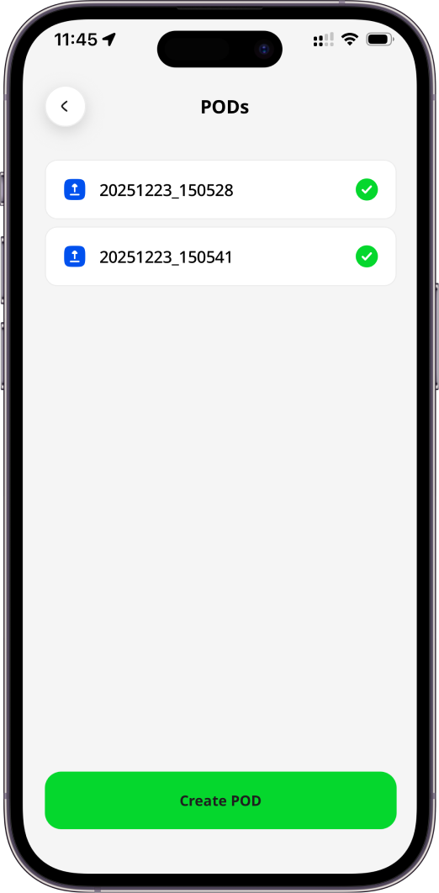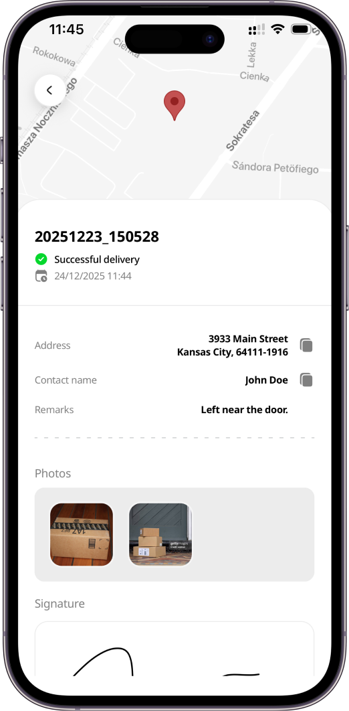

# Vehicle Checks

The created Vehicle check will be stored on Vehicle Checks page in the mobile app as well as in Geo2 Hub. Learn more about [Mobile App: Vehicle Checks](Mobile%20App_%20Vehicle%20Checks.md).

In the mobile app, you can view vehicle checks history from the past 30 days. To access the full vehicle checks history, you can visit [**Geo2 web-based Hub**](https://hub.geo2.com/en-GB/auth/signin). Data older than 30 days is available with Pro, Advanced, or Enterprise subscription.

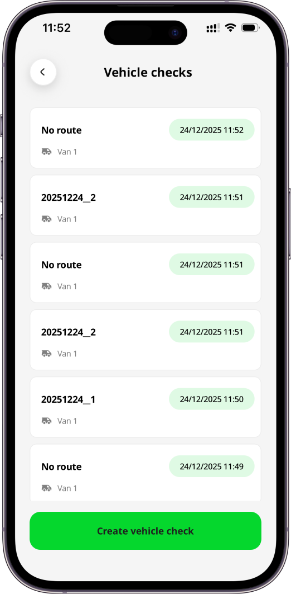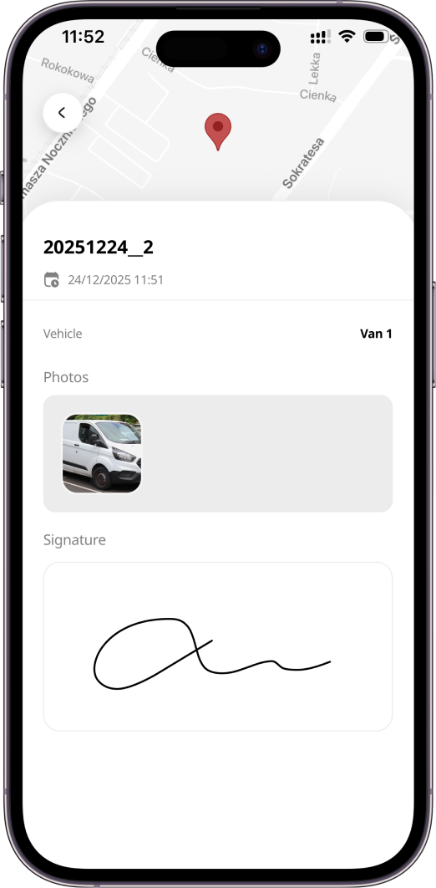

# Pending uploads

If you have a bad internet connection while uploading pictures to the app for a POD or vehicle check and it takes more time to upload them, you can find them on `Pending uploads` page in Menu.  Once an internet connection is good again, they will be uploaded automatically. Alternatively, you can click on them to push photos one more time.

# Settings

In Settings, you can edit your organization (Users and Subscriptions settings), environment (Routes, Vehicles, Failure reason codes, Recipient notifications settings) and device settings.

**Organization** is a group of users who share a subscription and collaborate on data in one or more environments. **Environments** let you represent teams within a single company or provide separate spaces for testing and productive use.

Examples:

- A large company (organization) with smaller teams (environments) working on different projects.
- A holding company (organization) with smaller companies (environments) working in different spheres.
- A middle-size company (organization) with several depots (environments).

As a Free level user, you will have only 1 environment. If you want to use more environments for different purposes, **upgrade to Enterprise**.

Check more details about [Mobile App: Settings](Mobile%20App_%20Settings.md).

# Organization and Environment

## Set up your organization

As a user, you can register and create your own organization to which you invite other users.  You may also be invited to join other organizations.  To [Hub: Accept Invitation](../Web-Based%20Hub/Hub_%20Accept%20Invitation.md), [Mobile App: Sign In](Mobile%20App_%20Sign%20In.md) to the app using the email address to which the invitation has been sent.

If you are not invited to any organization, the default organization will be created once your account is registered. **Free level subscription** will be assigned to you, **no card required**. You will be redirected to Map page to start planning your routes.

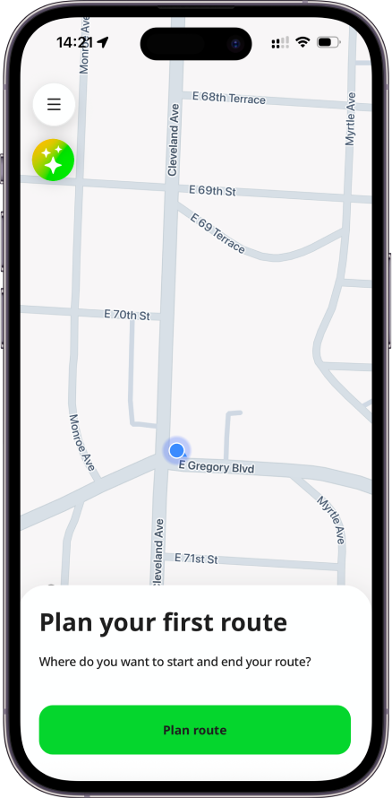

If you want to edit your organization and environment settings, press `Settings` in Menu. **Organization** is a group of users who share a subscription and collaborate on data in one or more environments. **Environments** let you represent teams within a single company or provide separate spaces for testing and productive use.

Examples:

- A large company (organization) with smaller teams (environments) working on different projects.
- A holding company (organization) with smaller companies (environments) working in different spheres.
- A middle-size company (organization) with several depots (environments).

As a Free level user, you will have only 1 environment. If you want to use more environments for different purposes, **upgrade to Enterprise**.

## Change Organization and Environment

To choose the organization to work in, you need to click on the `menu` icon at the top right corner of Map page, then click on the Organization.  You will see the dialog where you have to choose the organization you need if you have several.  After you choose the organization, you need to choose the environment if you have several.  To close the dialog just click on any space on the page.

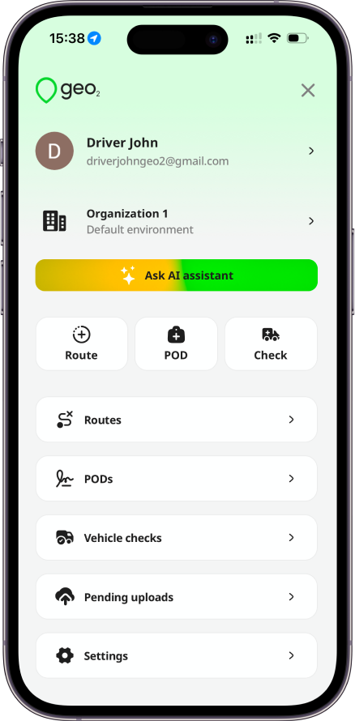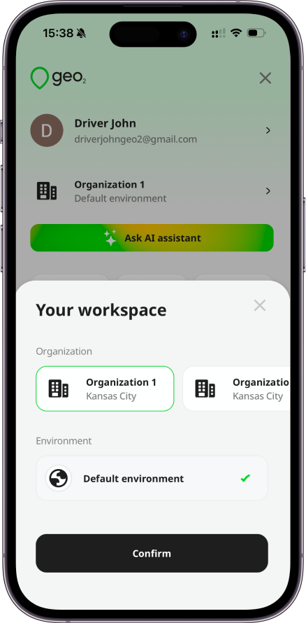

# Profile Information

When you register using an email and password or a mobile phone number, it will also be set as your display name. You can change it anytime in your Profile. To access your profile information, open the Menu and tap on your email address or display name. Remember to click the `Update` button to save any changes.

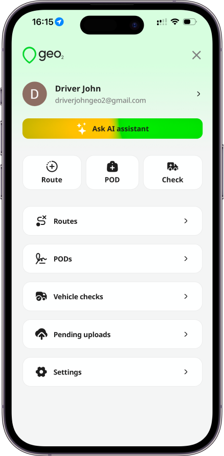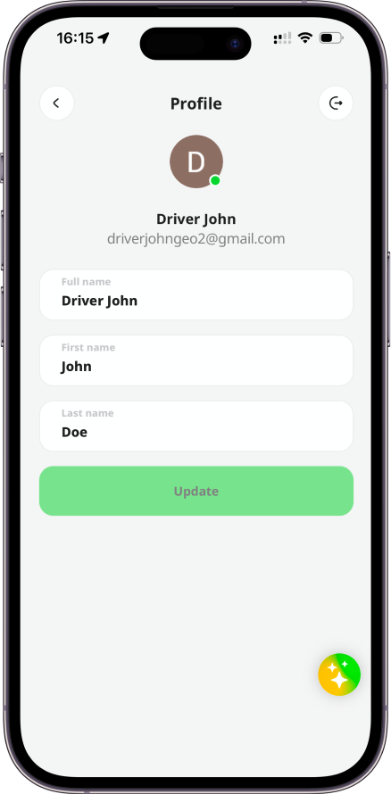
