# Mobile App: Vehicle Checks

# Introduction

Vehicle checks in the mobile app provide a standardized way for drivers to complete vehicle inspections before and after their routes. By digitizing the process, the feature ensures that all required checks are completed consistently, with results captured instantly and stored in the Geo2 app and web-based Hub.

In day-to-day operations, drivers can quickly go through a checklist, flag issues, and attach photos or comments where needed. This helps fleet managers monitor vehicle condition in real time, address defects faster, and maintain a reliable record of inspections for safety, maintenance, and compliance purposes.

# Enabling Vehicle Checks for Route

You can activate vehicle checks on the mobile app when the route is being started and completed in Settings in the app or in Settings → Environment → Routes in Hub.  By default, these options are disabled but you can change it anytime.  Recording of vehicle checks requires Advanced or Enterprise subscription.

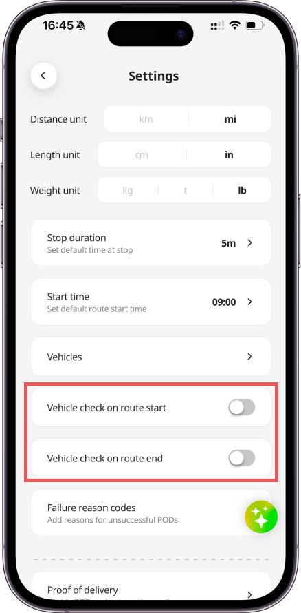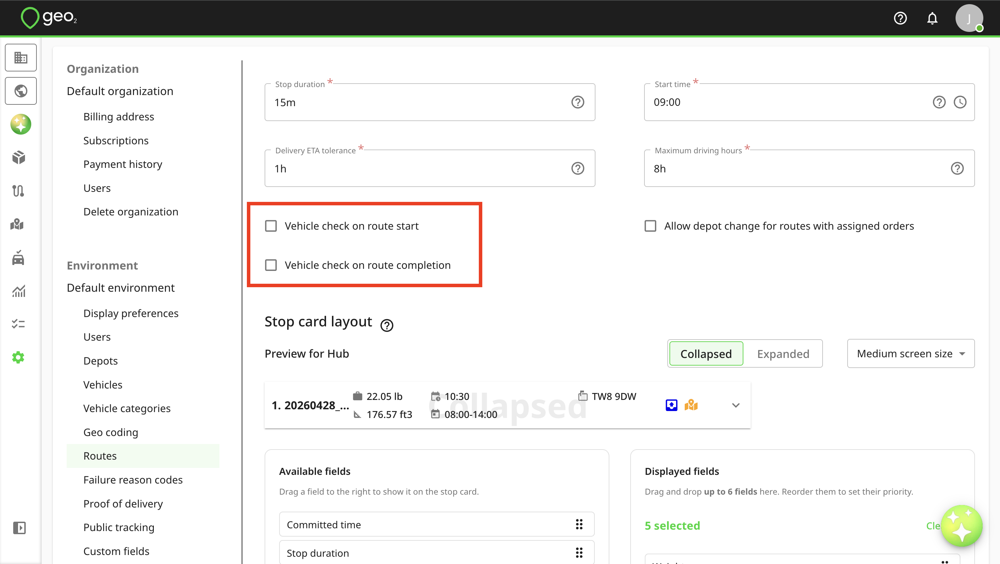

Even though vehicle checks are enabled or disabled in Settings, it is possible to manage vehicle checks for an individual route on Create/Edit route and Route view pages in Hub.

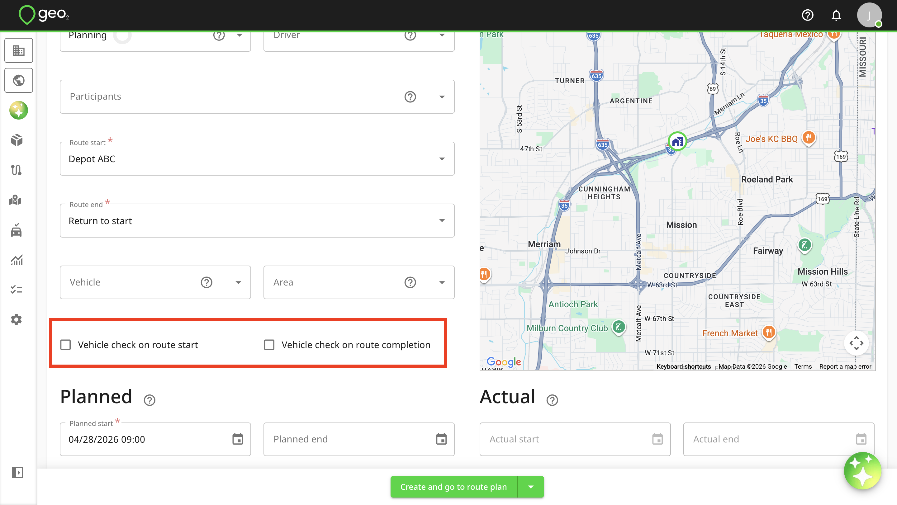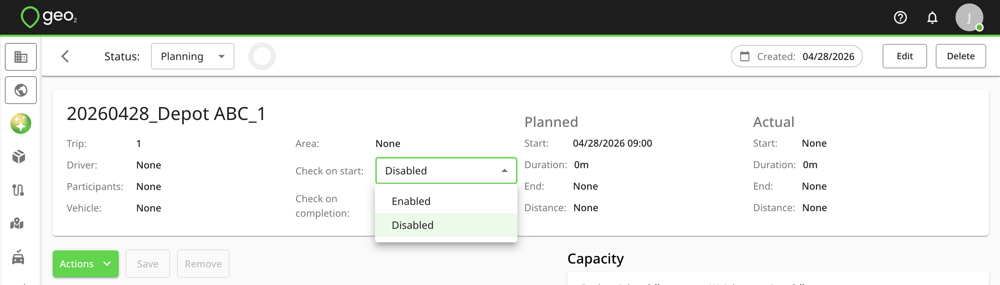

# Vehicle Check Creation for Route

If Vehicle checks are enabled, Vehicle check creation page will be displayed every time the route is started and completed.  If the geolocation is turned off, you will be asked to turn it on for the Vehicle check creation but you can create it without geolocation.

For the Vehicle check creation, you need to take or select photos of the vehicle (optional) and create a signature (optional).  Remember to save it.  If a vehicle is specified for a route, it will be displayed on Create vehicle check page and it is not possible to edit it.  If there is no vehicle provided for a route, you will be asked to select a vehicle existing in your environment settings for which you want to create this check.  If there are no vehicle yet created in the environment and you have permission to update environment settings, you will see the possibility to add a vehicle.

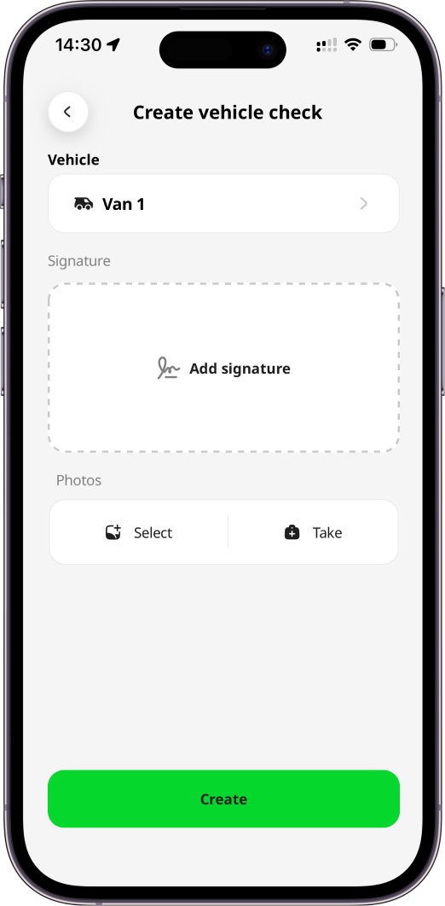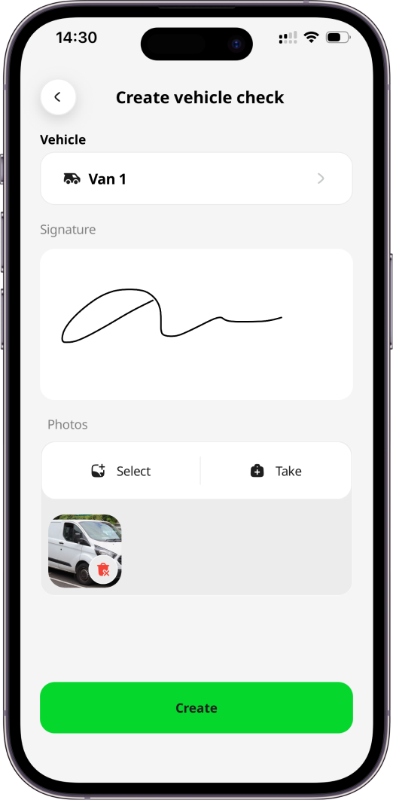

To complete the creation, press the `Create` button. If a vehicle check is enabled at route start, once it is recorded, the route will automatically begin and you will be redirected to the first stop. If a vehicle check is enabled at route completion, once it is recorded, the route will be marked as finished, and you can either proceed to the next route or plan a new one, depending on your permissions.

# Unplanned/Ad-hoc Vehicle Check

To create an unplanned/ad-hoc vehicle check that is not related to any route, you can press the `Create vehicle check` button in Menu or Vehicle checks page.

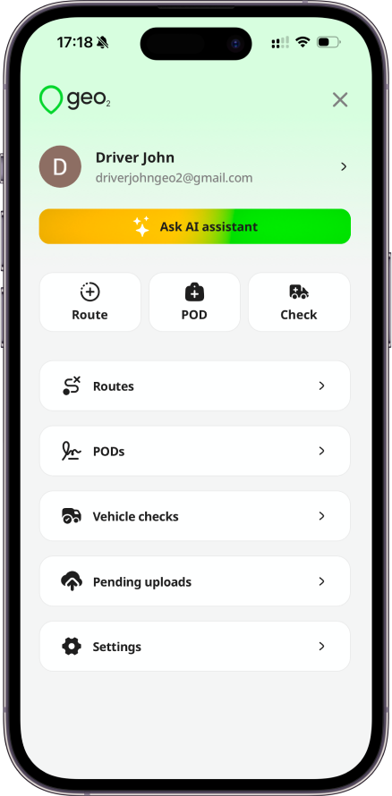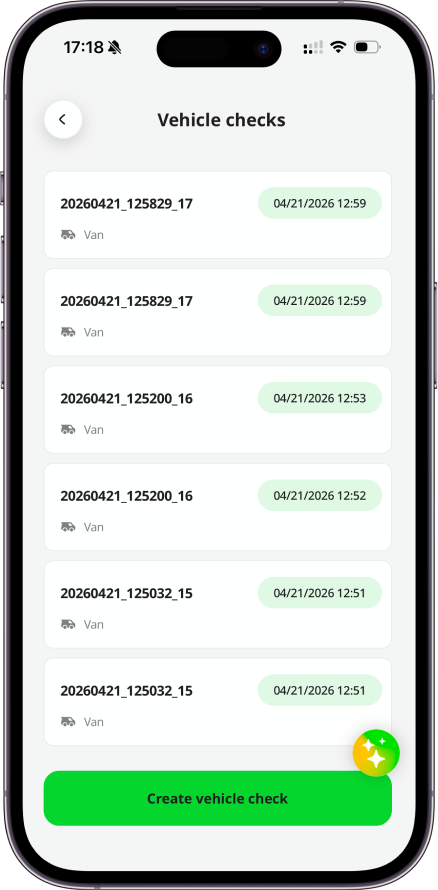

On Create vehicle check page, you will be asked to select a vehicle existing in your environment settings for which you want to create this check.  You also need to take or select photos of the vehicle (optional) and create a signature (optional).  If there are no vehicle yet created in the environment and you have permission to update environment settings, you will see the possibility to add a vehicle.

To complete the creation, press the `Create` button.

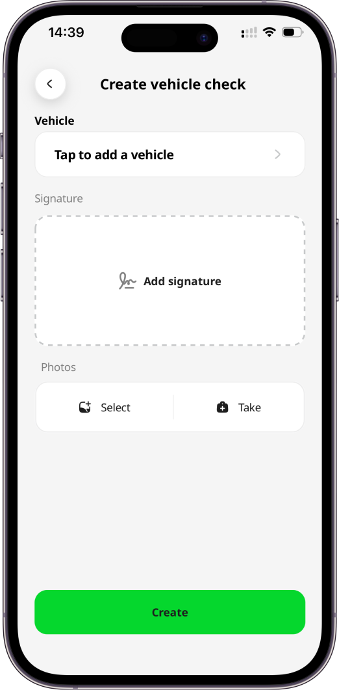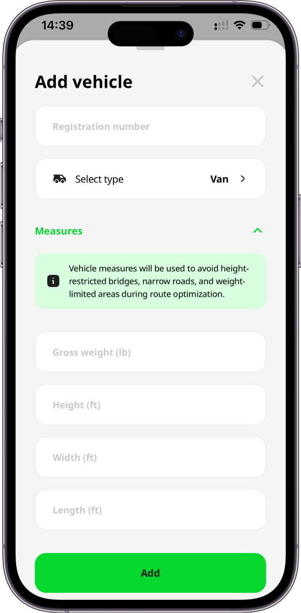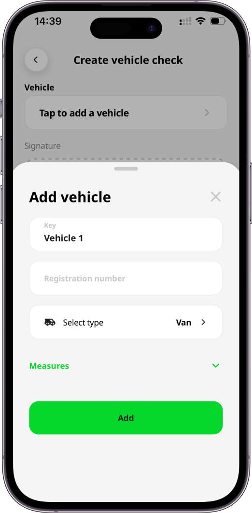

# Vehicle Checks History

The created vehicle check will be stored under Vehicle checks in the mobile app's menu and in Geo2 Hub. In the mobile app, you can view vehicle checks history from the past 30 days. To access the full vehicle checks history, you can visit [**Geo2 web-based Hub**](https://hub.geo2.com/en-GB/auth/signin). Data older than 30 days is available with Pro, Advanced, or Enterprise subscription.

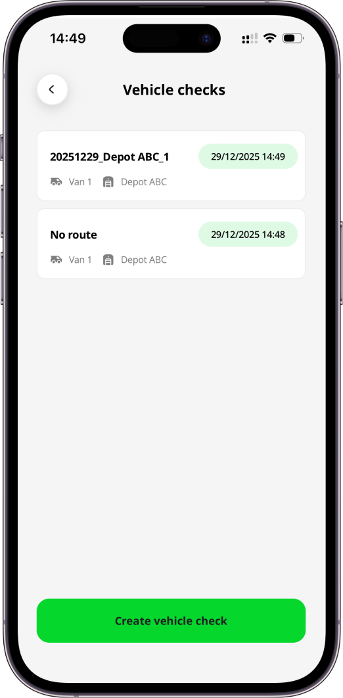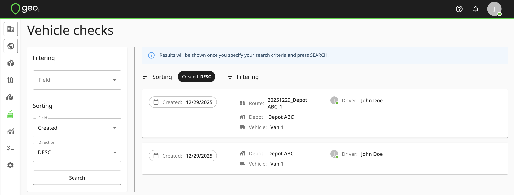

To view the details of a vehicle check, click on the Vehicle check card. Based on the available information, the following details may be displayed:

- Date and time of the vehicle check record
- Route key (for checks recorded at route start and completion)
- Vehicle key
- Depot key (if the vehicle is assigned to a depot)
- Photos and signature
- Driver’s geolocation at the time of the vehicle check recording

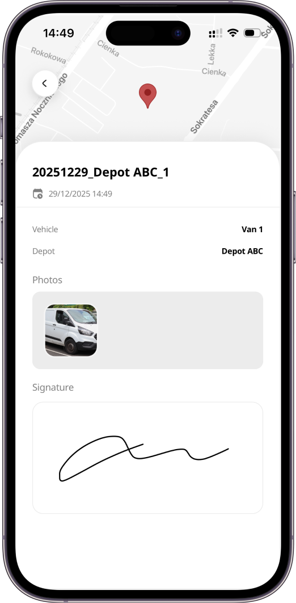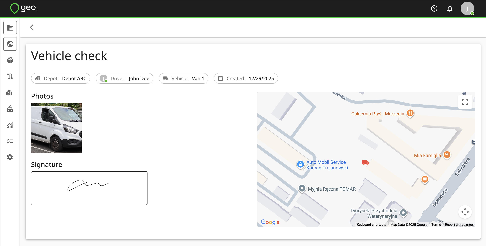

# Custom Vehicle Checks Fields

In Settings → Environment → Customer fields in Geo2 Hub, you can set up custom fields for Vehicle checks to ask for needed information from a driver on a route starting and completion.  Custom fields are available with Enterprise subscription level.

Examples of the custom fields from Environment settings:

- Ask for the vehicle registration number
- Ask if the damage is reported
- Ask for Mileage

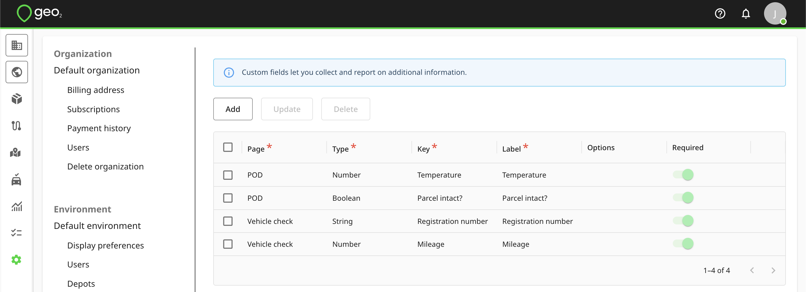

That's how it could look on Vehicle check creation page: 

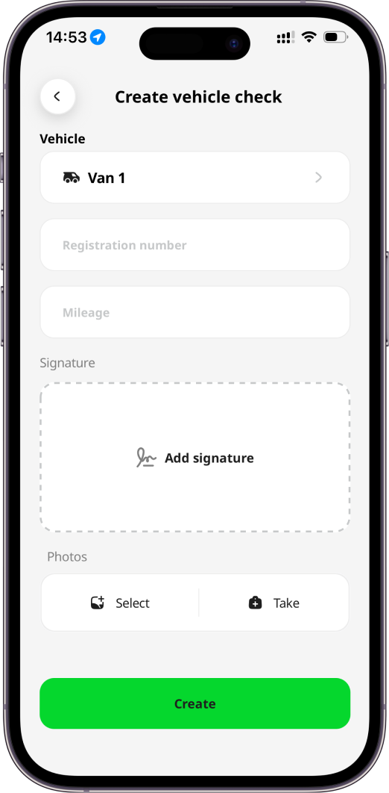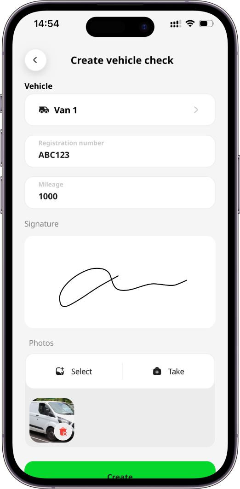

In Vehicle checks history it will be displayed this way:

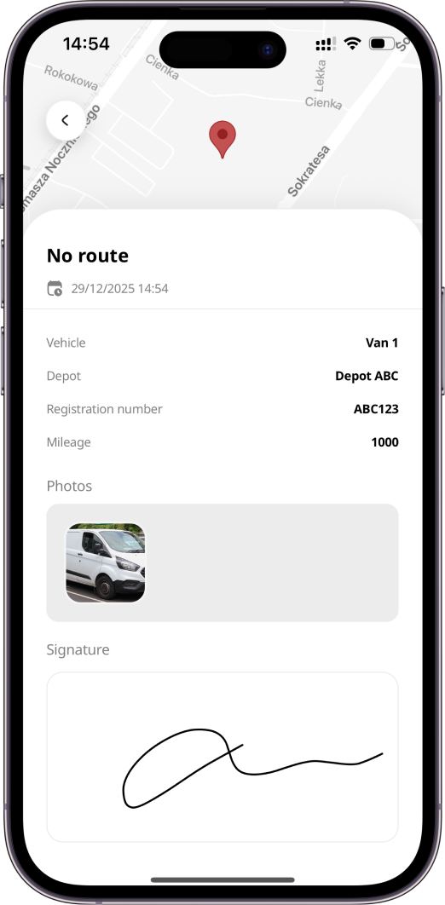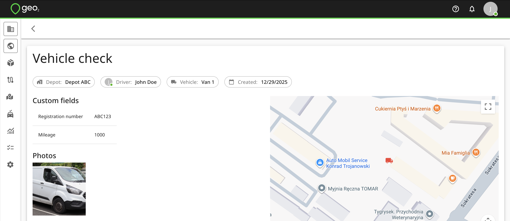
