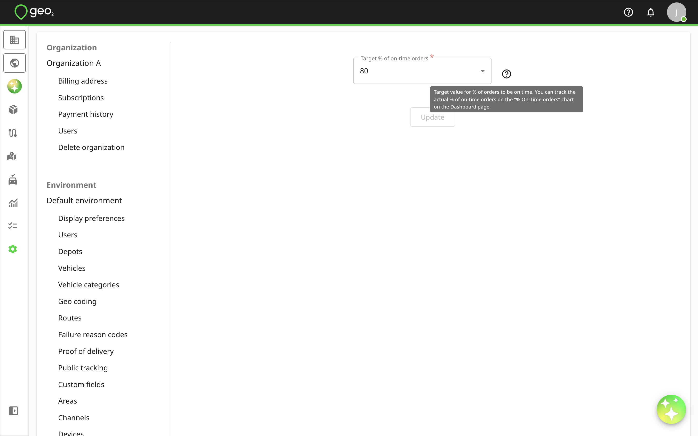

# Hub: Reporting Settings

Reporting settings in Settings → Environment in Hub let you define target values for analytics charts displayed on Analytics page.  Analytics and reporting require an Advanced or Enterprise subscription.

Target % of on-time orders means the target value for % of total orders to be on-time, by default, it's 80% but you can change it.  You can track the actual % of on-time orders on the “% On-Time Orders” analytics chart on Analytics page.

