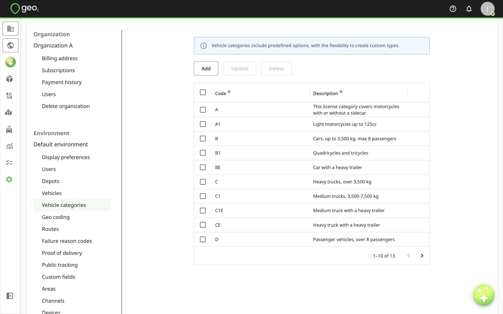
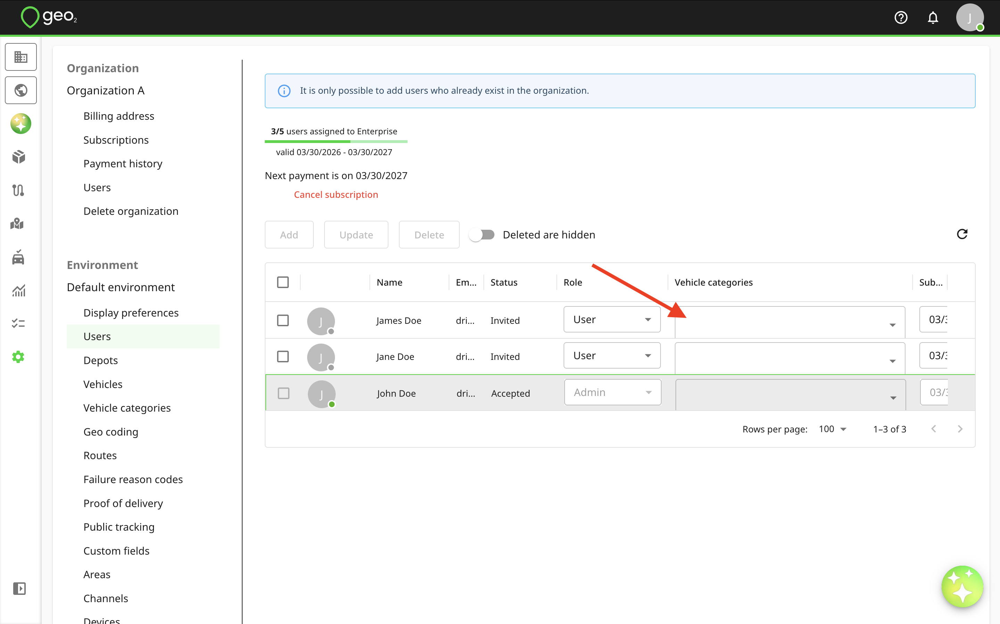
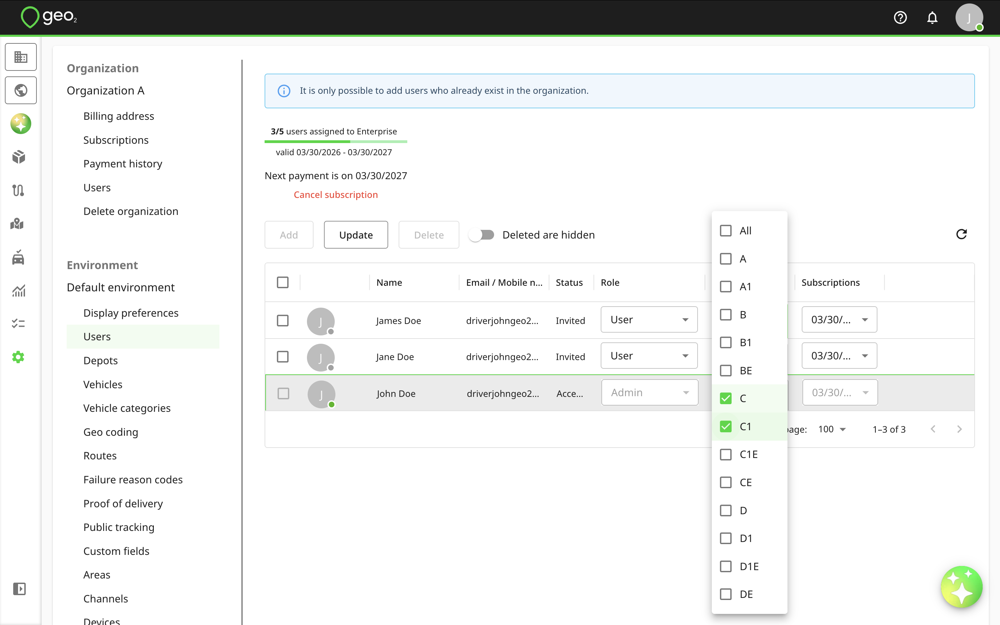
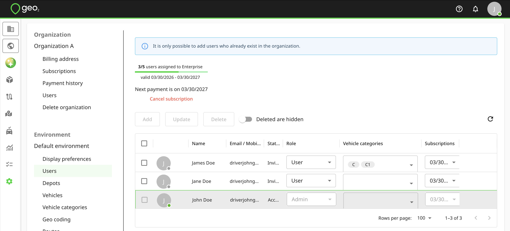
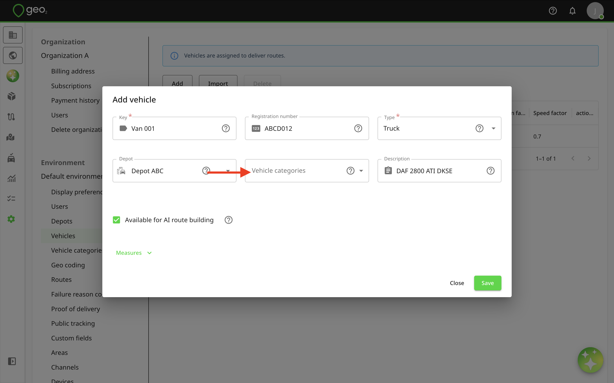
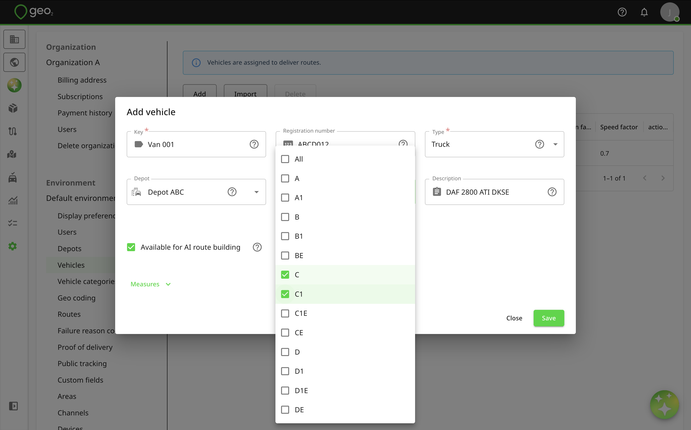
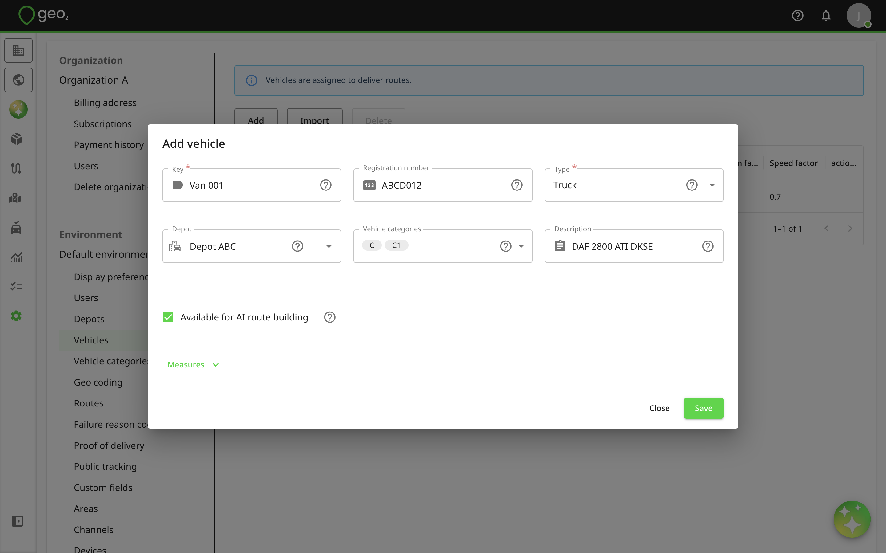
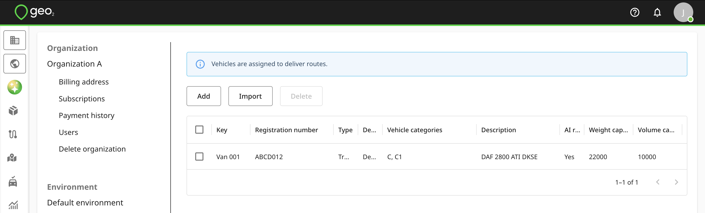

# Hub: Vehicle Categories Settings

Vehicle categories let you match users and vehicles for a route assignment. By default, standard driving categories (A, B, C, etc.) are listed. You can edit or delete them and create custom categories for your environment in Hub → Settings → Environment → Vehicle categories. Using or updating vehicle categories require an Advanced or Enterprise subscription.

These categories can then be assigned to vehicles (via Settings → Environment → [Hub: Vehicles Settings](Hub_%20Vehicles%20Settings.md)) and users (via Settings → Environment → [Hub: Users Settings](Hub_%20Users%20Settings.md)). It is possible to select multiple categories.

Assign categories to users by going to Settings → Environment → Users and pressing the Vehicle categories selector. Remember to press `Update` to save changes.

Assign categories to users by going to Settings → Environment → Vehicles and pressing the Edit button to update the vehicle. On the Edit vehicle dialog, press the Vehicle categories selector. Remember to press `Save` to save changes.

When planning a route on [Hub: Routes](../Hub_%20Routes.md)in Hub or via Geo2 API, the system will match the user’s and vehicle’s categories. Users without categories can only be assigned to vehicles without categories. Vehicles without categories can be assigned to any user.
